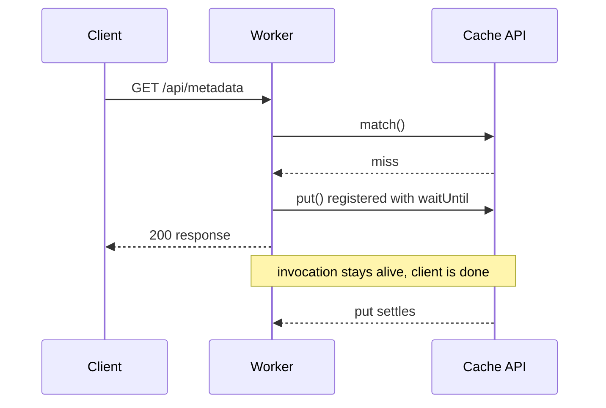

# Assets Bucket Metadata API

A Cloudflare Worker that lists the objects in an R2 bucket and returns each one with its custom metadata as JSON.

Images themselves are served by R2 directly. This Worker only answers the metadata API.

- Metadata API: `https://assets.fahadfaruqi.com/api/metadata`
- Images: `https://assets.fahadfaruqi.com/<key>`

## Endpoints

| Method | Path | Response |
| --- | --- | --- |
| `GET` | `/api/metadata` | `{ count, objects[] }`, see below |
| `HEAD` | `/api/metadata` | Same headers as `GET`, empty body |
| `OPTIONS` | any `/api/*` | `204`, CORS preflight headers, empty body |
| other method, or unknown path | any `/api/*` | `404` with `{ "error": "Not found" }` |

If R2 fails, or the bucket holds more than the Worker's ceiling of 10,000 objects,
you get `502` with `{ "error": "Internal error" }` rather than a partially built
gallery.

Every other path on `assets.fahadfaruqi.com` is served by R2, not by this Worker.

## Response shape

```json
{
  "count": 1,
  "objects": [
    {
      "url": "https://assets.fahadfaruqi.com/paintings/sunset.jpg",
      "key": "paintings/sunset.jpg",
      "size": 1048576,
      "uploaded": "2026-09-21T12:00:00.000Z",
      "etag": "abc123",
      "title": "Sunset Over the Ocean",
      "medium": "Oil on Canvas",
      "year": "2024",
      "description": "A vibrant sunset over the Atlantic"
    }
  ]
}
```

`url`, `key`, `size`, `uploaded`, and `etag` are generated from R2. Everything
after that comes from the object's custom metadata, with the metadata keys used
as-is, so `title` in this example was uploaded as the `title` metadata header. An
object uploaded without any custom metadata returns just the five generated fields.

Custom metadata is only present because `listAllObjects()` passes
`include: ["customMetadata", "httpMetadata"]` — the R2 binding omits both from
list results unless they are requested explicitly. Dropping that option silently
degrades every response to the five generated fields.

Objects under the `d/` prefix are skipped: they are resized derivatives of the
originals (see the "Derivatives" section below), not gallery items. Keys under `www/`
are skipped as well — they belong to fahadfaruqi.com, which shares the bucket.

## Derivatives

The originals in the bucket are 6016×4016 WebP at quality 85, 1–8 MB each — they were
PNGs of 110–140 MB until they were re-encoded in place with their metadata carried
over — and nothing in the app loads them. Every original is accompanied by four resized
WebP derivatives, generated offline and uploaded to the same bucket:

| Key | Width | Purpose |
| --- | --- | --- |
| `d/w2200/<name>.webp` | 2200 px | lightbox / viewer image |
| `d/w1600/<name>.webp` | 1600 px | the 1600w `srcset` candidate — 2× displays and the WebGL quads |
| `d/w800/<name>.webp` | 800 px | gallery grid cell |
| `d/lqip/<name>.webp` | 24 px | blur-up placeholder, also carries the aspect ratio |

The frontend builds those keys from the original's key (`src/lib/utils/variants.ts`),
so the naming convention is the contract between whatever generates the derivatives
and the site. Regenerating derivatives for a newly uploaded original means uploading
the four keys above with `Content-Type: image/webp` and a long-lived `Cache-Control`;
anything for the gallery itself needs the original uploaded with its `title`, `altText`,
`description`, `set` and `number` metadata intact.

## Deploy

```sh
bun install -g wrangler
wrangler login
wrangler deploy
```

`wrangler.toml` binds the R2 bucket `assets` as `ASSETS_BUCKET` and routes
`assets.fahadfaruqi.com/api/*` on the `fahadfaruqi.com` zone, so deploying needs
access to that zone.

Two things to know if you deploy from a script or an agent rather than your own
terminal:

- `wrangler login` needs a browser and a prompt. Non-interactively, wrangler refuses
to run unless `CLOUDFLARE_API_TOKEN` is set in the environment.
- Only one Worker can hold a given route. If you ever rename the Worker, delete the
old one first; two Workers matching `assets.fahadfaruqi.com/api/*` is a conflict,
not a takeover.

## Local development

```sh
wrangler dev
curl http://localhost:8787/api/metadata
```

`workers_dev` is off, so there is no `*.workers.dev` URL. Test locally or hit
production.

## Upload images with metadata

Attach custom metadata at upload time with `wrangler r2 object put`'s own flags:

```sh
npx wrangler r2 object put assets/paintings/sunset.jpg \
  --file=./sunset.jpg --remote \
  --content-type=image/webp \
  --cache-control='public, max-age=31536000, immutable' \
  --header='x-amz-meta-title:Sunset Over the Ocean' \
  --header='x-amz-meta-description:A vibrant sunset over the Atlantic'
```

Each metadata header becomes a field on that object in the API response. Avoid the
reserved names `url`, `key`, `size`, `uploaded`, and `etag`; metadata using those
overwrites the generated values.

The gallery expects `set`, `number`, `title`, `alttext` and `description`; EXIF the
camera wrote rides along with them. `scripts/manage-images` (see `scripts/README.md`)
is the supported path, because it extracts the EXIF and carries an object's metadata
across a re-encode — which raw `put` does not.

## Fetch on the site

```js
fetch("https://assets.fahadfaruqi.com/api/metadata")
  .then((res) => res.json())
  .then((data) => {
    data.objects.forEach((art) => {
      console.log(art.title, art.url, art.medium, art.year);
    });
  });
```

CORS is open (`Access-Control-Allow-Origin: *`) on every response, including the
`404`s, so the browser can call it from any origin. No API key.

A plain GET is a "simple" request, so the browser sends it directly and no
preflight happens. The `OPTIONS` row in the table above exists for the day a
caller adds a custom header, sends `Content-Type: application/json`, or uses a
method other than GET/HEAD/POST. The Worker then answers the browser's automatic
preflight with `204`, echoes back whatever `Access-Control-Request-Headers` was
asked for, and caches the result for 1 day.

## Caching

A cache miss is answered immediately and backfilled in the background, so no client
ever waits on a cache write:



A hit returns at `match()` and the rest never runs.

| Layer | TTL |
| --- | --- |
| Workers cache (per data center) | 10 minutes |
| Browser | 10 minutes |

The response is cached for 10 minutes, keyed on the request URL. New uploads will not
show up until that entry expires or the Worker is redeployed. To see fresh data
immediately, add a query param (`?v=2`); it is part of the cache key, so it misses
the old entry.

Two things worth knowing about that 10 minutes:

- It is the stored response's TTL, taken from the `s-maxage` directive. `max-age`
covers the browser's copy.
- The cache is **per data center**. Content cached in one does not exist in another
until that one is asked, so a location serving its first request pays for a full
listing. There is no single global copy.

## Layout

```
metadata-api/
├── src/index.js     Worker source (single file)
├── wrangler.toml    R2 binding, route, compatibility date
├── AGENTS.md        Notes for agents/contributors working on this
└── README.md
```

No `package.json`, no build step, no tests. `wrangler deploy` is the whole
pipeline. This directory has no git repo of its own; the parent repository tracks
these files directly.
